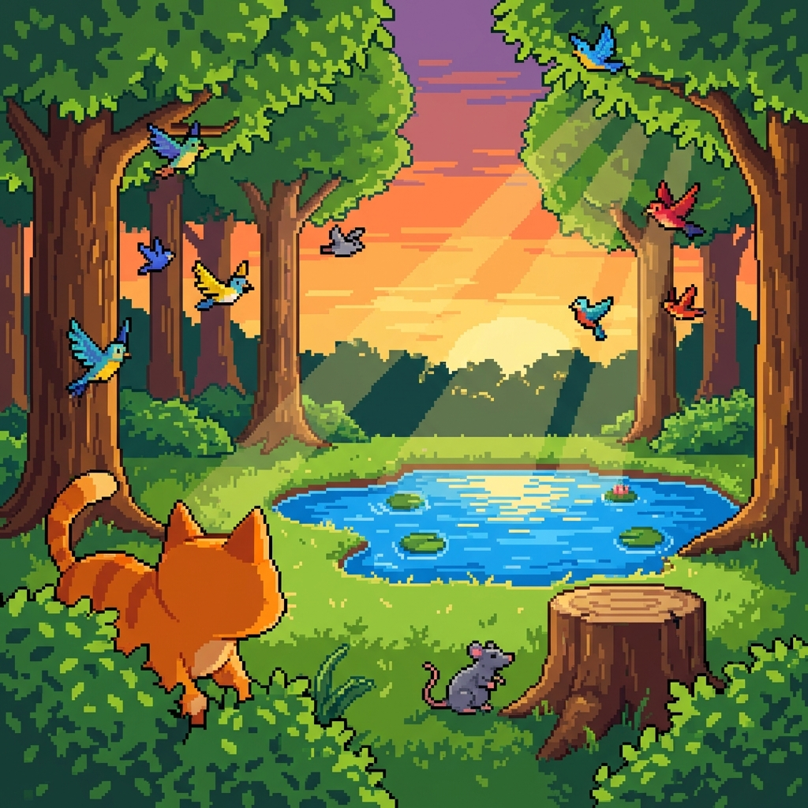

# 🐾 Petivolution

[](https://github.com/yongjiexue88/Petivolution/blob/main/LICENSE)
[](https://github.com/yongjiexue88/Petivolution/stargazers)
[](https://github.com/yongjiexue88/Petivolution)

> **Life finds a way—under your control.** 🌿

**Petivolution** is an open-source **Ecological Simulation Sandbox**. Built with React, Phaser 3, and advanced Utility AI, it allows you to observe artificial life forms as they hunt, forage, and evolve in a dynamic ecosystem. Adjust environmental factors in real-time and witness how tiny changes ripple through the food web.

### 🚀 [PLAY LIVE DEMO](https://petivolution.com/)


*Observe emergent behaviors: Cats hunting rats, birds flocking to bushes, and a balanced ecosystem in motion.*

---

## ✨ Why Petivolution?

Unlike static simulations, Petivolution uses a **Utility AI** system where every animal makes autonomous decisions based on its needs (hunger, thirst, fear) and the environment around it.

*   **Emergent Complexity**: Watch as simple rules lead to complex pack hunting and flocking behaviors.
*   **Real-time Intervention**: Drop water sources, plant bushes, or introduce predators to see how the population reacts.
*   **Developer Friendly**: Modular architecture using Web Workers for heavy lifting—easy to add new species or logic.

---

## 🎮 What Can I Do Right Now?

The current version (v0.1.0) is fully playable:
- **Spawn & Observe**: Deploy 11+ different animal species with unique AI profiles.
- **Manipulate Environment**: Place water, trash, and bushes to sustain (or disrupt) life.
- **Deep Diagnostics**: Click any animal to see its "brain"—real-time utility scores and current goals.
- **Persistent Worlds**: Save and load your ecosystem states.

---

## 🌿 The Ecosystem

| Species | Type | Behavior |
|---------|------|----------|
| 🐱 **Cat** | Predator | Solitary hunter; hunts rats to restore hunger. |
| 🐭 **Rat** | Scavenger | Forages in trash; flees from predators. |
| 🐺 **Wolf** | Pack Hunter | Coordinated hunters; strong cohesion behavior. |
| 🦅 **Hawk** | Aerial Predator | High-speed flyer with exceptional vision range. |
| 🐍 **Snake** | Ambush Predator | Low metabolism; hides in bushes for the perfect strike. |
| 🐦 **Bird** | Prey/Flock | Fast-moving, uses perches for safety. |
| 🧺 **Raccoon** | Opportunist | Smart scavenger; loves rummaging through trash. |

---

## �️ Developer Guide

### Prerequisites
- Node.js (v18+)
- npm (v9+)

### Local Setup
```bash
# 1. Clone the repository
git clone https://github.com/yongjiexue88/Petivolution.git
cd Petivolution

# 2. Install dependencies (Monorepo)
npm install

# 3. Spin up the dev environment
# Starts both frontend (Vite) and backend (Sim Server)
npm run dev
```

### Key Scripts
- `npm run dev`: Concurrent frontend + backend development.
- `npm run build`: Production build for the frontend.
- `npm test`: Run unit tests across the simulation and UI.
- `npm run lint`: Ensure code quality with ESLint.

### 🏗️ Architecture
Petivolution splits the heavyweight simulation from the rendering to ensure 60FPS:
- **`sim/`**: Pure logic layer. Handles AI, movement, and vital decay.
- **`worker/`**: Runs the simulation in a separate thread (Web Worker).
- **`game/`**: Phaser 3 rendering engine.
- **`app/`**: React-based UI for toolbars and detailed panels.

---

## 🗺️ Roadmap & What's Next

We are constantly evolving! Here is what's on the horizon:
- [ ] **Dynamic Seasons**: Environmental changes affecting food availability.
- [ ] **Genetic Evolution**: Subtle trait inheritance (speed, sight, hunger resistance).
- [ ] **Advanced AI Pack 3**: Territorial behaviors and complex mating rituals.
- [ ] **Multiplayer Observation**: Peer-to-peer world sharing.

---

## 🤝 Contributing

We love contributors! Whether you're fixing a bug, adding a new species, or polishing the UI:
1. **Open an Issue**: Discuss your idea beforehand.
2. **Fork & PR**: Submit your changes for review.
3. **Check the Docs**: See our internal dev notes in `/docs`.

**Feel like something is missing?** [Open a PR](https://github.com/yongjiexue88/Petivolution/pulls) or [Create an Issue](https://github.com/yongjiexue88/Petivolution/issues)!

---

## 📄 License

MIT © [yongjiexue88]
