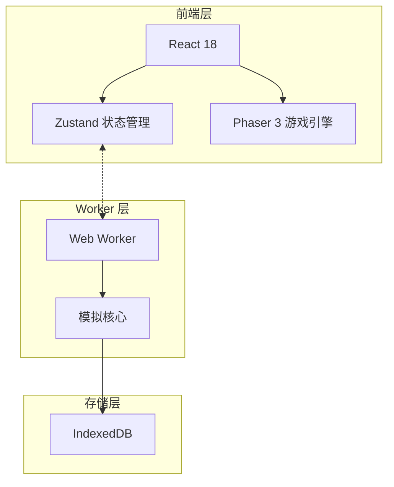
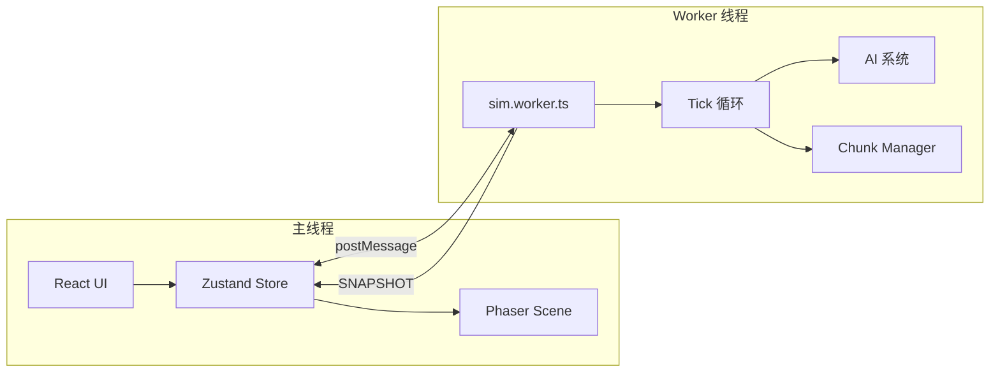
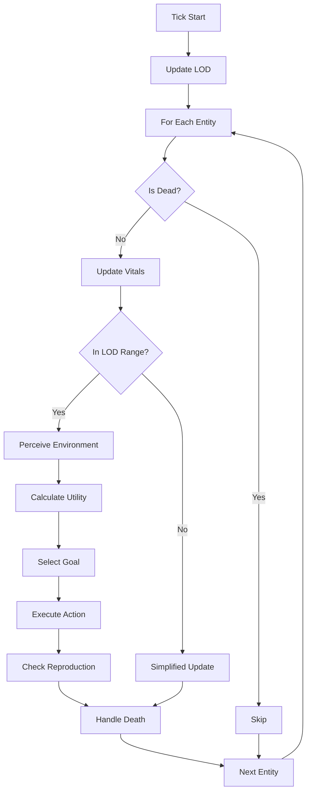
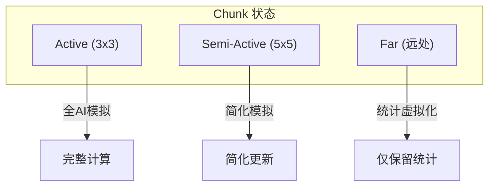
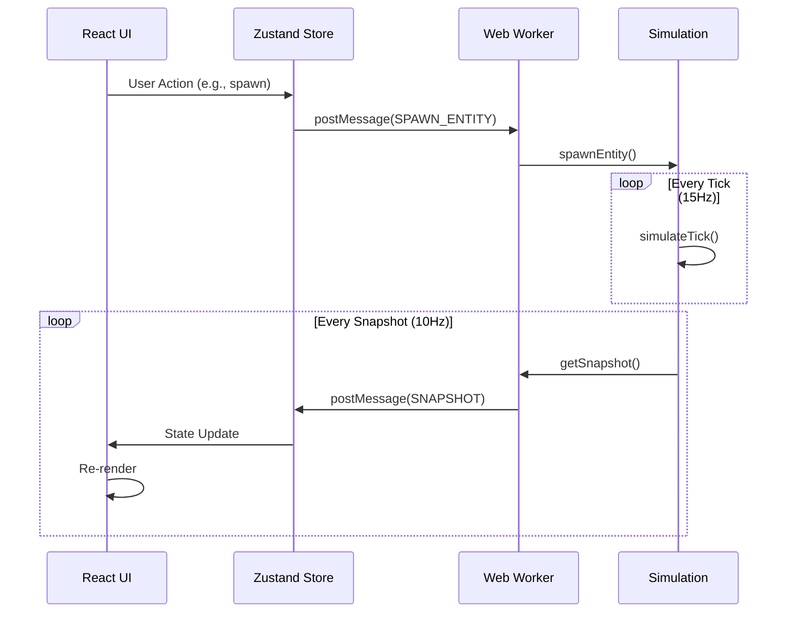
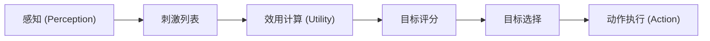
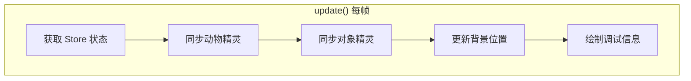
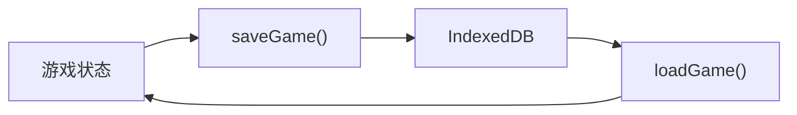

# 🐾 Petivolution - 项目技术总览

> **生态模拟沙盒游戏** - 观察动物行为、调整生态平衡

---

## 📋 目录

1. [项目概述](#项目概述)
2. [技术栈](#技术栈)
3. [系统架构](#系统架构)
4. [目录结构](#目录结构)
5. [核心模块详解](#核心模块详解)
6. [数据流与通信协议](#数据流与通信协议)
7. [AI 决策系统](#ai-决策系统)
8. [物种与配置系统](#物种与配置系统)
9. [渲染与场景管理](#渲染与场景管理)
10. [存档系统](#存档系统)
11. [验收标准](#验收标准)

---

## 项目概述

Petivolution 是一个**生态模拟沙盒游戏**，核心玩法循环为：

```
投放动物 → 观察行为 → 发现问题 → 环境干预 → 生态稳定
```

### 核心生物

| 生物 | 角色 | 行为 |
|------|------|------|
| 🐱 **猫** | 捕食者 | 通过捕猎老鼠获取食物 |
| 🐭 **鼠** | 食腐者 | 在垃圾堆中觅食 |

### 环境对象

| 对象 | 图标 | 作用 |
|------|------|------|
| 水源 | 💧 | 动物喝水恢复"口渴"值 |
| 灌木 | 🌿 | 提供庇护所和休息地点 |
| 垃圾堆 | 🗑️ | 老鼠的主要食物来源 |

---

## 技术栈



| 层级 | 技术 | 用途 |
|------|------|------|
| **前端框架** | React 18 + TypeScript | UI 组件与面板 |
| **构建工具** | Vite 6 | 开发服务器与打包 |
| **游戏引擎** | Phaser 3 | 2D 渲染与场景管理 |
| **状态管理** | Zustand | 全局游戏状态 |
| **模拟层** | Web Worker | 独立线程运行模拟逻辑 |
| **存档** | IndexedDB (idb) | 本地存档持久化 |
| **噪声生成** | simplex-noise | 地形与资源分布生成 |
| **测试** | Vitest | 单元测试框架 |

---

## 系统架构



### 核心设计原则

1. **线程分离**: 模拟逻辑完全在 Web Worker 中运行，不阻塞主线程渲染
2. **数据驱动**: 物种行为由配置文件定义，便于扩展和调参
3. **LOD 系统**: 基于相机位置的分块加载，支持无限世界
4. **Utility AI**: 基于效用评分的决策系统，行为可解释

---

## 目录结构

```
src/
├── app/                    # React UI 层
│   ├── App.tsx            # 主应用组件
│   ├── App.css            # 全局样式
│   ├── components/        # 通用组件
│   │   ├── GameCanvas.tsx # Phaser 画布容器
│   │   └── Toolbar.tsx    # 工具栏
│   ├── panels/            # 功能面板
│   │   ├── AnimalDetailPanel.tsx  # 动物详情
│   │   ├── EventLogPanel.tsx      # 事件日志
│   │   ├── GraveyardPanel.tsx     # 墓地记录
│   │   ├── SpawnPanel.tsx         # 投放面板
│   │   └── WorldRulesPanel.tsx    # 世界规则
│   └── store/
│       └── gameStore.ts   # Zustand 状态管理
│
├── game/                   # Phaser 游戏层
│   └── scenes/
│       └── WorldScene.ts  # 主游戏场景
│
├── sim/                    # 纯逻辑模拟层
│   ├── ai/                # AI 系统
│   │   ├── actions.ts     # 动作执行
│   │   ├── perception.ts  # 感知系统
│   │   └── utility.ts     # 效用决策
│   ├── config/            # 配置文件
│   └── core/              # 核心模拟
│       ├── tick.ts        # 主循环
│       ├── chunkManager.ts # 分块管理
│       └── spawner.ts     # 实体生成
│
├── shared/                 # 共享模块
│   ├── types.ts           # TypeScript 类型定义
│   ├── constants.ts       # 全局常量
│   └── species.config.ts  # 物种配置
│
├── storage/               # 存储层
│   └── save.ts           # IndexedDB 存档
│
├── worker/                # Web Worker
│   └── sim.worker.ts     # 模拟入口
│
├── main.tsx              # 应用入口
└── index.css             # 全局样式
```

---

## 核心模块详解

### 1. 模拟核心 (`sim/core/tick.ts`)

主循环函数 `simulateTick()` 每帧执行以下步骤：



**关键函数:**

| 函数 | 职责 |
|------|------|
| `createSimulation()` | 创建新的模拟状态 |
| `simulateTick()` | 执行单帧模拟 |
| `updateVitals()` | 更新生命体征 (饥饿/口渴/疲劳) |
| `handleDeath()` | 处理死亡逻辑 |
| `getSnapshot()` | 生成发送给主线程的快照 |

### 2. 分块管理器 (`sim/core/chunkManager.ts`)

实现无限世界的 LOD (Level of Detail) 系统：



**配置参数:**

| 参数 | 值 | 说明 |
|------|-----|------|
| `CHUNK_SIZE_TILES` | 32 | 每个分块的 tile 数 |
| `ACTIVE_RADIUS` | 1 | 相机周围活跃块半径 |
| `SEMI_ACTIVE_RADIUS` | 2 | 半活跃块半径 |

### 3. Web Worker (`worker/sim.worker.ts`)

处理主线程与模拟层的通信：

**命令类型 (Main → Worker):**

| 命令 | 用途 |
|------|------|
| `INIT_WORLD` | 初始化世界 |
| `LOAD_SAVE` | 加载存档 |
| `SET_RULES` | 修改世界规则 |
| `SET_TIME_SCALE` | 设置时间速度 |
| `SPAWN_ENTITY` | 投放动物 |
| `PLACE_OBJECT` | 放置对象 |
| `REMOVE_OBJECT` | 移除对象 |
| `SELECT_ENTITY` | 选中实体 |
| `UPDATE_CAMERA` | 更新相机位置 |
| `REQUEST_SAVE` | 请求保存 |
| `RESET_WORLD` | 重置世界 |

**更新类型 (Worker → Main):**

| 更新 | 用途 |
|------|------|
| `SNAPSHOT` | 世界快照 (实体/对象/统计) |
| `ENTITY_DETAIL` | 选中实体详情 |
| `SPAWN_FAILED` | 投放失败通知 |
| `SAVE_READY` | 存档生成完成 |
| `ERROR` | 错误信息 |

---

## 数据流与通信协议



### 时间参数

| 参数 | 值 | 说明 |
|------|-----|------|
| `simTickHz` | 15 | 模拟帧率 |
| `snapshotHz` | 10 | 快照发送频率 |
| `perceptionEveryNTicks` | 5 | 感知频率 |
| `decisionEveryNTicks` | 10 | 决策频率 |

---

## AI 决策系统

### Utility AI 架构



### 1. 感知系统 (`perception.ts`)

扫描周围环境，生成刺激列表：

```typescript
interface PerceptionResult {
    stimuli: Stimulus[];           // 所有检测到的刺激
    nearestPrey: {...} | null;     // 最近猎物 (猫用)
    nearestPredator: {...} | null; // 最近捕食者 (鼠用)
    nearestWater: {...} | null;    // 最近水源
    nearestBush: {...} | null;     // 最近灌木
    nearestTrash: {...} | null;    // 最近垃圾堆
}
```

### 2. 效用计算 (`utility.ts`)

为每个目标计算效用分数：

**目标类型:**

| Goal | 适用物种 | 描述 |
|------|---------|------|
| `flee` | 鼠 | 逃离捕食者 |
| `drink` | 全部 | 喝水 |
| `eat` | 鼠 | 从垃圾堆进食 |
| `hunt` | 猫 | 追捕猎物 |
| `rest` | 全部 | 休息恢复 |
| `wander` | 全部 | 随机闲逛 |

**分数计算因素:**

```
Score = Base + (Urgency × Need) + Bonus - (Distance × Penalty) + Personality
```

- **Base**: 基础分数
- **Urgency**: 紧急度权重 (hunger/thirst/fatigue/fear)
- **Bonus**: 环境加成 (看到目标)
- **Penalty**: 距离惩罚
- **Personality**: 性格调整

### 3. 动作执行 (`actions.ts`)

根据当前目标执行具体行为：

| 状态 | 动作 | 说明 |
|------|------|------|
| `idle` | 发呆 | 无事可做 |
| `wander` | 闲逛 | 随机方向移动 |
| `moveTo` | 移动 | 向目标位置移动 |
| `drink` | 喝水 | 在水源处恢复口渴值 |
| `eat` | 进食 | 在垃圾堆/猎物处恢复饥饿值 |
| `chase` | 追逐 | 追赶猎物 (猫) |
| `attack` | 攻击 | 攻击猎物 (猫) |
| `flee` | 逃跑 | 远离捕食者 (鼠) |
| `sleep` | 睡觉 | 恢复疲劳值 |
| `dead` | 死亡 | 已死亡状态 |

---

## 物种与配置系统

### 物种配置结构 (`species.config.ts`)

```typescript
interface SpeciesConfig {
    id: SpeciesId;
    
    move: {
        speedTilesPerTick: number;  // 移动速度
        wanderJitter: number;        // 闲逛随机性
        turnSmooth: number;          // 转向平滑度
    };
    
    sense: {
        radiusTiles: number;         // 感知半径
    };
    
    vitals: {
        hungerDecayPerTick: number;  // 饥饿下降速率
        thirstDecayPerTick: number;  // 口渴下降速率
        fatigueDecayPerTick: number; // 疲劳下降速率
        drinkGainPerTick: number;    // 喝水恢复速率
        eatGainPerTick: number;      // 进食恢复速率
        sleepGainPerTick: number;    // 睡觉恢复速率
        // ...
    };
    
    combat?: {...};      // 战斗配置 (猫)
    reproduction?: {...}; // 繁殖配置
    utility: {...};       // AI 权重配置
}
```

### 🐭 老鼠配置亮点

| 属性 | 值 | 说明 |
|------|-----|------|
| 移动速度 | 0.07 tiles/tick | 略快于猫 |
| 感知半径 | 10 tiles | 警觉范围 |
| 饥饿下降 | 0.0006/tick | ~111秒饿死 |
| 恐惧权重 | 2.8 | 非常容易逃跑 |
| 繁殖概率 | 20%/秒 | 高繁殖率 |

### 🐱 猫配置亮点

| 属性 | 值 | 说明 |
|------|-----|------|
| 移动速度 | 0.06 tiles/tick | 略慢但稳定 |
| 感知半径 | 12 tiles | 更大的狩猎范围 |
| 攻击范围 | 0.6 tiles | 近距离攻击 |
| 一击必杀 | true | 抓到老鼠直接击杀 |
| 捕猎加成 | 0.55 | 强烈的狩猎欲望 |

### 性格系统

| 性格 | 特点 |
|------|------|
| `curious` | 好奇心强，爱闲逛探索 |
| `cautious` | 谨慎，更容易逃跑 |
| `brave` | 勇敢，更愿意冒险觅食/捕猎 |

---

## 渲染与场景管理

### WorldScene (`game/scenes/WorldScene.ts`)

Phaser 3 主场景，负责：

1. **背景渲染**: 无限网格纹理
2. **实体同步**: 从 Store 获取快照，同步精灵
3. **对象渲染**: 水源/灌木/垃圾堆
4. **输入处理**: 拖拽、缩放、点击
5. **调试绘制**: 感知范围、目标线、分块边界



### 相机控制

| 操作 | 功能 |
|------|------|
| 拖拽 | 移动视角 |
| 滚轮 | 缩放 (0.25x ~ 4x) |
| 点击动物 | 选中查看详情 |

---

## 存档系统

### IndexedDB 存档 (`storage/save.ts`)



### 存档数据结构

```typescript
interface WorldSaveData {
    schemaVersion: 1;
    
    meta: {
        saveId: string;
        name: string;
        createdAtIso: string;
        updatedAtIso: string;
        playTicks: number;
    };
    
    world: {
        seed: number;
        mapId: string;
        tick: number;
        rules: WorldRule;
    };
    
    objects: WorldObject[];
    entities: EntityRuntime[];
    graveyard: GraveyardEntry[];
    chunks: Record<ChunkId, ChunkData>;
}
```

### 存档 API

| 函数 | 功能 |
|------|------|
| `saveGame(id, name, data)` | 保存游戏 |
| `loadGame(id)` | 加载存档 |
| `listSaves()` | 列出所有存档 |
| `deleteSave(id)` | 删除存档 |
| `getAutoSave()` | 获取自动存档 |
| `saveAutoSave(data)` | 保存自动存档 |

---

## 验收标准

### V1 功能验收

| 标准 | 描述 | 状态 |
|------|------|------|
| **稳定性** | 10只鼠 + 2只猫，持续运行≥5分钟不崩溃 | ✅ |
| **可解释性** | 点选动物可见：当前状态、原因、需求值 | ✅ |
| **干预有效** | 放置水源/灌木/垃圾点能明显改变种群走向 | ✅ |
| **性能** | 200-300个实体不掉帧 | ✅ |

### 测试覆盖

项目使用 Vitest 进行单元测试，测试文件分布：

- `src/sim/ai/*.test.ts` - AI 系统测试
- `src/sim/core/*.test.ts` - 核心模拟测试
- `src/shared/*.test.ts` - 共享模块测试

运行测试：

```bash
npm run test        # 交互模式
npm run test:unit   # 单次运行
```

---

## 快速开始

```bash
# 安装依赖
npm install

# 启动开发服务器
npm run dev

# 构建生产版本
npm run build

# 预览生产版本
npm run preview
```

---

## 未来规划

### V2 特性

- [ ] 更多物种 (狗、鸟等)
- [ ] 繁殖系统完善
- [ ] 家族树可视化
- [ ] 季节与天气系统

### V3 特性

- [ ] 多人协作沙盒
- [ ] 基因遗传系统
- [ ] 用户自定义物种

---

*文档生成时间: 2026-01-07*
