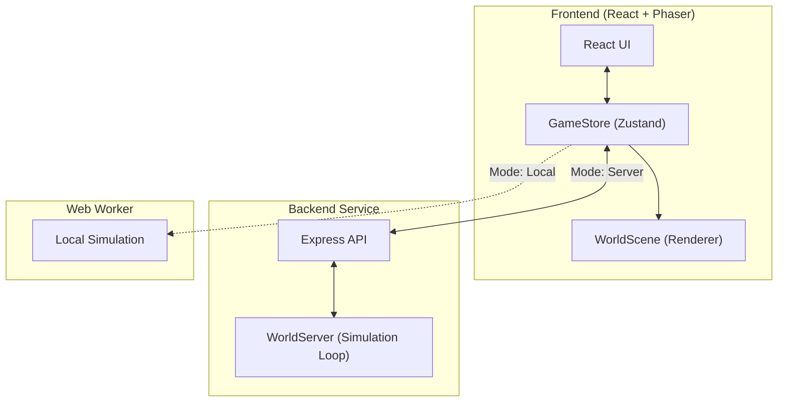

# Petivolution - Technical Architecture & Systems

> **Ecological Simulation Sandbox** - Observe emergent animal behaviors, manage ecosystem balance, and shape the world.
> **Current Version**: V1.3 (Hybrid Client/Server Architecture) + V4 Content (Ecosystem Expansion)

---

## 📋 Table of Contents

1. [System Architecture](#1-system-architecture)
2. [Project Structure](#2-project-structure)
3. [Simulation Core & AI](#3-simulation-core--ai)
4. [Species & Behaviors](#4-species--behaviors)
5. [Frontend & User Interaction](#5-frontend--user-interaction)
6. [Backend API](#6-backend-api)

---

## 1. System Architecture

Petivolution uses a **Hybrid Simulation Architecture** controlled by the `useServer` flag in `gameStore`.

### Mode A: Local Simulation (Default/Dev)
*   **Host**: Browser Web Worker (`sim.worker.ts`).
*   **Mechanism**: Runs the full simulation loop locally. Zero latency.
*   **Sync**: Sends `SNAPSHOT` events to the main thread for rendering.

### Mode B: Authoritative Server (V1.3)
*   **Host**: Node.js Backend (`backend/src/world/WorldServer.ts`).
*   **Mechanism**: Persistence server runs the logic.
*   **Sync**: Client polls (`/api/world/snapshot`) at 10Hz to sync state.
*   **Actions**: Client sends POST requests (`/api/actions/*`) to modify state (Spawn/Place).



---

## 2. Project Structure

The project follows a Monorepo structure separating view logic from simulation authority.

```
/
├── frontend/               # React + Phaser Client
│   ├── src/
│   │   ├── app/           # React UI & State
│   │   │   ├── api/       # ServerClient.ts (API Wrapper)
│   │   │   ├── store/     # gameStore.ts (State Management)
│   │   │   └── ui/        # React Components (SpawnPanel, Toolbar)
│   │   ├── game/          # Phaser Logic
│   │   │   └── scenes/    # WorldScene.ts (Main Renderer)
│   │   ├── sim/           # Simulation Core (Universal)
│   │   │   ├── ai/        # Utility AI Logic (actions.ts, utility.ts)
│   │   │   ├── config/    # World Rules & Gen Config
│   │   │   └── core/      # Physics & Loop (tick.ts)
│   │   └── shared/        # Shared Types & Configs (species.config.ts)
│
├── backend/                # Node.js Server
│   ├── src/
│   │   ├── index.ts       # API Entry Points
│   │   └── world/         # Server-Side Simulation Host
│
└── memory/                # Project Documentation & Workflows
```

---

## 3. Simulation Core & AI

The AI uses a **Utility-Based Decision System**. Every tick (15Hz), entities evaluate their needs and environment to choose the "Best Goal".

### The Decision Loop (`tick.ts` -> `utility.ts` -> `actions.ts`)

1.  **Perception**: Entity scans surroundings for `Stimulus` (Water, Food, Predator, Mate).
2.  **Utility Scoring**: Calculates a score (0-1+) for each potential Goal.
    *   `Score = Base + (Urgency × Need) + Bonus - DistancePenalty`
3.  **Selection**: The Goal with the highest score becomes the `CurrentGoal`.
4.  **Execution**: `actions.ts` executes the logic for the current state (move, eat, sleep).

### Utility Factors
| Goal | Trigger Factors (Urgency) | Action Taken |
| :--- | :--- | :--- |
| **Flee** | High Fear (Predator detected) | fast move away from threat / to cover |
| **Drink** | High Thirst + Water detected | move to water -> drink |
| **Eat/Hunt** | High Hunger + Food detected | move to trash (Rat) / chase prey (Cat) |
| **Rest** | High Fatigue + Day/Night cycle | move to bush/perch -> sleep |
| **Forage** | Hunger (Chicken/Bird) | peck ground / look for seeds |
| **Rummage** | Hunger (Raccoon) | inspect trash bins |
| **Wander** | (Default) Low needs | random movement |

---

## 4. Species & Behaviors

Configuration defined in `frontend/src/shared/species.config.ts`.

### Tier 1: Foragers & Prey
| Species | Role | Unique Behaviors | Config Highlights |
| :--- | :--- | :--- | :--- |
| **Rat** 🐀 | Scavenger | `Flee` to Bush, `Eat` Trash | High Breeding, Low Health |
| **Chicken** 🐔 | Forager | `Peck` ground, `Flee` (low prio) | Diurnal, Social (Flocking planned) |
| **Small Bird** 🐦 | Aerial Forager | `Fly/Hop`, `Perch` on structures | Very fast movement, Low Health |

### Tier 2: Mesopredators (Opportunists)
| Species | Role | Unique Behaviors | Config Highlights |
| :--- | :--- | :--- | :--- |
| **Cat** 🐱 | Hunter | `Stalk`, `Chase` Rats/Birds | High Speed, High Damage |
| **Raccoon** 🦝 | Scavenger | `Rummage` Trash (Night), `Eat` Eggs | Nocturnal, High Curiosity |
| **Crow** 🐦‍⬛ | Scavenger | `Scavenge` Carcass, `Fly` | High Sense Range, Intelligent |
| **Fox** 🦊 | Hunter | `Ambush` (Bash/Cover) | Fast Burst Speed |

### Tier 3: Apex & Guardians
| Species | Role | Unique Behaviors | Config Highlights |
| :--- | :--- | :--- | :--- |
| **Dog** 🐕 | Guardian | `Patrol`, `Bark` (Scare pests) | High Health, Loyal (Manual Spawn) |
| **Hawk** 🦅 | Aerial Predator | `Dive` Attack | Extremely Fast, High Vision |
| **Wolf** 🐺 | Pack Hunter | `Pack Hunt`, `Howl` | (Experimental) Group AI |

### World Resources
*   **Water**: Restores Thirst. Infinite resource (regen).
*   **Bush**: Hiding spot for Flee, Resting spot.
*   **Trash**: Food source for Rats/Raccoons.
*   **Perch**: Resting spot for Birds (Trees/Fences).
*   **Food Bowl**: Food source for Dogs/Pets.

---

## 5. Frontend & User Interaction

The frontend (`WorldScene.ts`) handles rendering and user input, decoupled from the simulation.

### Visual System
*   **Sprites**: Dynamic asset loading from `/assets/sprites/` (supports placeholders).
*   **Animations**: Mapped dynamically based on entity state (e.g., `state: 'flee'` -> plays `run` anim).
*   **Day/Night**: Global overlay with alpha blend based on simulation time.

### Interaction Tools
*   **Select**: Click entity to view real-time stats (Hunger, Thirst, Current Action).
*   **Spawn (God Mode)**: Place animals directly into the world. Costs "God Power".
*   **Place (God Mode)**: Place static objects (Bush, Water, Trash).
*   **Delete**: Remove objects/entities.

### Debug Features
*   **Target Lines**: Visualizes AI pathfinding target.
*   **Sense Radius**: Shows perception range circle.
*   **Chunk Grid**: Visualizes dynamic world loading zones.

---

## 6. Backend API

(Active only in Server Mode)

### Endpoints
*   `GET /health`: Server heartbeat & tick count.
*   `GET /api/world/snapshot`: Returns `SnapshotEntity[]` and `WorldObject[]`.
*   `GET /api/world/entity/:id`: Returns full internal state (Utility Scores, Memory) for inspection.
*   `POST /api/actions/spawn`: Request to spawn Entity.
*   `POST /api/actions/place`: Request to place Object.

---

*Last Updated: 2026-01-08 (V4 Ecosystem Update)*
