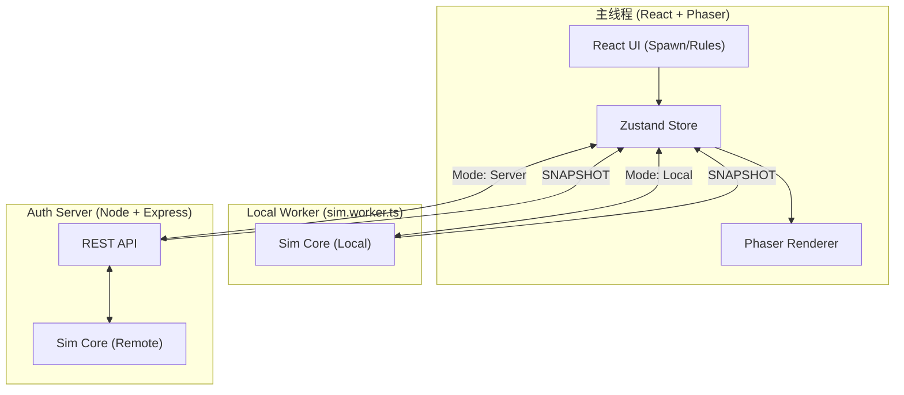

# Petivolution - 项目技术总览 (Architecture Overview)

> **生态模拟沙盒游戏** - 观察动物行为、调整生态平衡。支持本地 Web Worker 模拟与云端权威服务器同步。

---

## 📋 目录

1. [项目概述](#项目概述)
2. [系统架构 (Hybrid Architecture)](#系统架构-hybrid-architecture)
3. [目录结构 (Monorepo)](#目录结构-monorepo)
4. [核心模块详解](#核心模块详解)
5. [AI 决策系统 (Utility AI)](#ai-决策系统-utility-ai)
6. [后端 API 参考](#后端-api-参考)
7. [物种与配置系统](#物种与配置系统)
8. [存档系统](#存档系统)

---

## 项目概述

Petivolution 是一个基于效用 AI (Utility AI) 的**生态模拟沙盒游戏**。

### 核心生物与环境
- 🐱 **猫 (Predator)**: 捕食老鼠，需要水分。
- 🐭 **鼠 (Prey/Scavenger)**: 在垃圾堆寻宝，躲避捕食者。
- 💧 **水源 / 🌿 灌木 / 🗑️ 垃圾堆**: 提供生存资源与庇护。

---

## 系统架构 (Hybrid Architecture)

本项目采用 **混合模拟架构**，可根据 `gameStore` 中的 `useServer` 标志在两种模式间切换：

### 1. 本地模式 (Web Worker)
模拟逻辑完全在浏览器后台线程运行，通过 `Snapshot` 机制同步到主线程。
- **优点**: 无网络延迟，离线可用。

### 2. 服务器模式 (Authoritative Backend)
模拟逻辑运行在 Node.js 权威服务器上，客户端通过轮询 (Polling) 获取状态。
- **优点**: 强一致性，支持未来多玩家协作。



---

## 目录结构 (Monorepo)

项目已重构为 `frontend` 与 `backend` 隔离的单体仓库结构。

```
/
├── frontend/               # 前端应用
│   ├── src/
│   │   ├── app/           # React 逻辑与状态
│   │   │   ├── api/       # ServerClient (API 客户端)
│   │   │   ├── store/     # gameStore.ts
│   │   │   └── panels/    # UI 面板 (Spawn, Detail, etc.)
│   │   ├── game/          # Phaser 渲染层 (WorldScene.ts)
│   │   ├── sim/           # 模拟核心 (Client/Server 共享)
│   │   │   ├── ai/        # Utility AI (Perception, Actions)
│   │   │   └── core/       # Tick, ChunkManager, Spawner
│   │   ├── shared/        # 类型定义与配置 (constants.ts)
│   │   ├── storage/       # IndexedDB 存档逻辑
│   │   └── worker/        # sim.worker.ts 入口
│   └── package.json
│
├── backend/                # 后端权威服务
│   ├── src/
│   │   ├── index.ts       # Express 入口
│   │   └── world/         # WorldServer (Authoritative Sim)
│   └── package.json
│
└── memory/                # 项目记忆与架构文档
```

---

## 核心模块详解

### 1. 模拟核心 (`sim/core/tick.ts`)
主循环函数 `simulateTick()` 负责每帧的生命体征更新、AI 决策触发与位移计算。

### 2. 分块管理器 (`sim/core/chunkManager.ts`)
实现无限世界的 **LOD (Level of Detail)** 系统：
- **Active (相机周围)**: 完整 AI 指令执行。
- **Inactive**: 仅执行生命体征衰减或停止计算（取决于世界规则）。

---

## AI 决策系统 (Utility AI)

采用效用评分机制，让动物行为更加自然且可预测。

```
Score = Base + (Urgency × NeedPercentage) + EnvironmentBonus - DistancePenalty
```

| 目标 (Goal) | 决策因素 |
| :--- | :--- |
| **Flee** | 发现捕食者 (High Fear) |
| **Drink** | 口渴值高 + 发现水源 |
| **Eat** | 饥饿值高 + 发现食物 (鼠:垃圾, 猫:鼠) |
| **Rest** | 疲劳值高 + 发现灌木 |
| **Wander** | 无紧迫需求时的随机漫步 |

---

## 后端 API 参考

当开启服务器模式时，客户端调用以下接口：

| 接口 | 方法 | 功能 |
| :--- | :--- | :--- |
| `/health` | `GET` | 检查服务器状态与当前 Tick |
| `/api/world/snapshot` | `GET` | 获取当前全量/增量世界快照 |
| `/api/actions/spawn` | `POST` | 投放动物 (Species, X, Y) |
| `/api/world/entity/:id` | `GET` | 获取指定实体的详细 AI 状态 |

---

## 物种与配置系统 (`shared/constants.ts`)

### 时间参数
- **Sim Tick Hz**: 15Hz (模拟频率)
- **Snapshot Hz**: 10Hz (渲染更新频率)

### 物种特征 (V1)
- **鼠**: 速度 0.07, 感知 10, 高繁殖率。
- **猫**: 速度 0.06, 感知 12, 强捕猎欲望。

---

## 存档系统

- **本地存档**: 使用 `IndexedDB` 存储序列化的世界状态（包括 Entities, Objects, Rules, Grveyard）。
- **云端存档**: (未来规划) 将支持用户账户同步。

---

*文档最后更新: 2026-01-07 (Refactored for Hybrid V1.3)*
